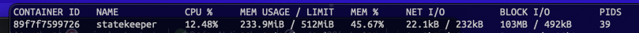
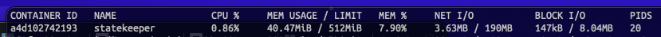

# Binance spot market crypto trading bots

## Components
Project `cryptopredator` running in docker node, which contains:
- `statekeeper` service, which provide access to databases and user orders updating.
- `redis_binance` to serve bot states between relaunches.
- `postgres` as persistent database.
- `prometheus` to get metrics.
- `grafana` for metrics visualization.
- few bot services with trading strategies logic implementations.

## Directories structure
- `data` - PostgreSQL data folder.
- `metrics` - Logs of all services, dumps, and metrics configurations.
- `commons` - Project's common java library.
- other directories with services and trading robots.

## Prepare
First of all need to install [this forked version](https://github.com/zscauer/binance-java-api) of `binance-java-api`:
> git clone https://github.com/zscauer/binance-java-api.git  
> cd binance-java-api  
> mvn clean install

Next required dependency is [ta4j](https://github.com/zscauer/ta4j).

Next step is installing common library of project (directory `commons`):
> cd commons  
> gradle clean build publishToMavenLocal

After that need to export environment variables with binance credentials:
> export BINANCE_API_KEY="Your Binance API key"  
> export BINANCE_SECRET_KEY="Your Binance Secret Key"

## Configuration
*Many parameters are moved in `.env` files in each service directory. Main `.env` file placed into root project's folder.*  
**You should check this files before launch.**

## Running
First of all `statekeeper` service should be build/launched:
> cd statekeeper  
> gradle clean build  
> docker build --tag=statekeeper .

After that you could build/launch all bots you need, for example `indicatorvirginbot`:
> cd indicatorvirginbot  
> gradle clean build  
> docker build --tag=indicatorvirginbot .

When all docker images are built - it's ready to launch:
> docker compose up

### Native
Some services are ready to run as native image. To build and run native image (`statekeeper` for example):

First of all, need to it launch [with special agent](https://www.graalvm.org/22.0/reference-manual/native-image/Agent/), which will define proxy usage in application and collect information about it.

```dockerfile
# Dockerfile
FROM springci/graalvm-ce:java17-0.12.x

ADD ./build/libs/statekeeper.jar .

ENTRYPOINT ["java", \
"-agentlib:native-image-agent=config-output-dir=/tmp/logs/native-image", \
"-jar", \
"statekeeper.jar"]
```

It needs to service to work in all possible scenarios while agent collecting information.
After service shut down, directory `native-image` will contains all required to compiler information
and should be copied into `src/main/resources/META-INF/`, after that, native service can be built (by JDK with GraalVM):

> gradle --settings-file settings-native.gradle processAot  
> gradle --settings-file settings-native.gradle nativeCompile  
> docker build --tag=statekeeper -f Dockerfile-native .

Difference in memory consumption and startup time between JVM and native versions of service:

JVM:


Native:


